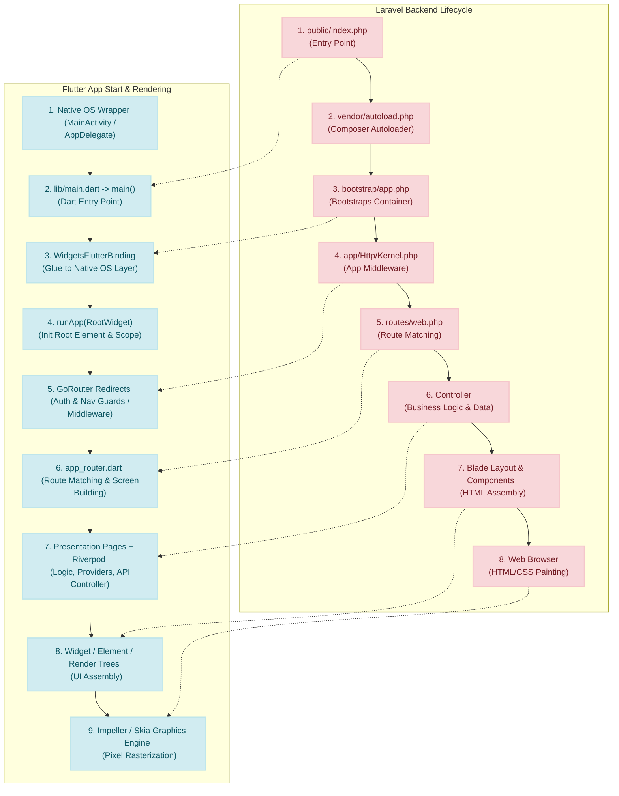

# Flutter Execution & Render Lifecycle: A Guide for Laravel Developers

For a web developer familiar with Laravel, learning Flutter's start-to-render pipeline becomes intuitive when compared to Laravel's request-response lifecycle. This document maps the Laravel core architecture to Flutter's execution framework.

---

## 1. The Startup Pipeline: Laravel vs. Flutter

When a request hits Laravel, it goes through a specific sequence of files to boot, route, apply middleware, and render HTML. Here is how Flutter performs the same process to render pixels on the user's screen.



---

## 2. Direct Architecture Comparison

### Entry Point
*   **Laravel (`public/index.php` & `vendor/autoload.php`):** The web server directs all incoming traffic here. It sets up file autoloading.
*   **Flutter (`lib/main.dart` -> `main()`):** The compiler configures this as the execution start. When the app is launched, the native Android/iOS wrapper loads the Flutter engine and calls `main()`.

### Framework Bootstrapping
*   **Laravel (`bootstrap/app.php`):** Initializes the service container, registers core services, and configures the HTTP kernel.
*   **Flutter (`WidgetsFlutterBinding.ensureInitialized()`):** Registers the connection between the Flutter framework and the host operating system (handling touch gestures, lifecycle events, and window metrics).

### Middleware (Filters & Guards)
*   **Laravel (`app/Http/Kernel.php`):** Processes incoming requests, manages cookies/sessions, validates CSRF tokens, and checks authentication.
*   **Flutter (GoRouter `redirect` in `app_router.dart`):** Acts as route middleware. Whenever a user navigates to a new route, this guard intercepts the transition, checks Hive or SecureStorage for authentication state, and redirects the user (e.g., to `/auth` if unauthenticated).

### Route Definition
*   **Laravel (`routes/web.php` or `routes/api.php`):** Resolves URLs to specific Controllers.
*   **Flutter (`core/router/app_router.dart`):** Resolves route strings (e.g. `/home`, `/quiz/session`) to builder functions returning specific `Page` widgets.

### Controllers & Data Loading
*   **Laravel (`App\Http\Controllers`):** Fetches models, processes input, and returns data wrapped in views or JSON responses.
*   **Flutter (Riverpod Providers + Screen States):** Handles data fetching and business logic. Providers watch API endpoints via HttpClient (e.g., `DioClient`) and serve reactive states to screens, which dynamically re-render when data updates.

---

## 3. The 3-Tree Rendering Engine: How Widgets Become Pixels

Unlike browsers which parse HTML strings to construct a DOM tree and then apply CSS styles, Flutter works via a **Three-Tree Architecture**:

```
[ Widget Tree ] --(Creates)--> [ Element Tree ] --(Creates)--> [ RenderObject Tree ]
```

1.  **Widget Tree:** A declarative configuration tree (immutable). You define *what* you want the UI to look like (e.g. `Container`, `Text`). It is rebuilt frequently.
2.  **Element Tree:** The logical manager/glue (mutable). It matches widgets to their runtime states and controls the lifecycle of components. It determines if a widget update needs to recreate a view or just modify it.
3.  **RenderObject Tree:** The physical engine tree. It is responsible for calculating layouts (sizing, padding, constraints) and painting (rasterizing lines, colors, and text to actual pixels on screen).

> [!NOTE]
> This tree separation is why Flutter is exceptionally fast; when state updates, only the necessary parts of the RenderObject tree are repainted rather than re-creating the entire page structure.
